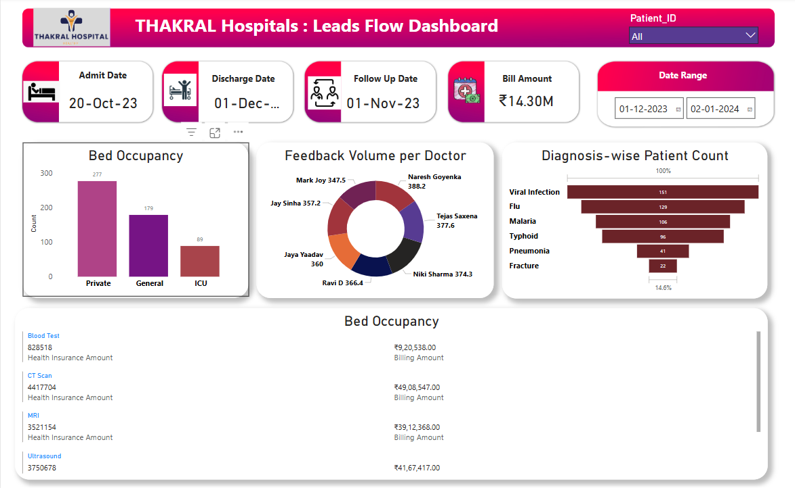

# 🏥 THAKRAL Hospitals: Leads Flow Dashboard

## 📌 Project Summary

This Power BI project delivers a comprehensive Leads Flow Dashboard for **THAKRAL Hospitals**, focusing on optimizing hospital operations, physician performance tracking, financial analysis, and disease pattern identification. The dashboard offers dynamic visualizations to support data-driven decision-making and operational efficiency.

---

## 📊 Key Features

- **📅 Patient Flow Monitoring**
  - Tracks Admit Date, Discharge Date, and Follow-Up Date.
  - Helps identify patient retention and service efficiency.

- **🧑‍⚕️ Doctor Performance Analysis**
  - Feedback volume per doctor visualized to evaluate individual engagement and patient satisfaction.

- **💰 Financial Insights**
  - Total billing amount with department-wise segmentation.
  - Tracks costs of services like CT Scan, MRI, Blood Test, and Ultrasound.

- **🛏️ Bed Occupancy Management**
  - Occupancy statistics for Private, General, and ICU beds.
  - Supports efficient resource allocation and capacity planning.

- **📉 Disease Trend Analysis**
  - Diagnosis-wise patient count helps spot seasonal or demographic-based health issues.

- **📅 Date Range Filter**
  - Enables focused analysis for specific durations, enhancing report relevance.

---

## 🛠️ Tech Stack

- **Power BI Desktop**
- DAX (Data Analysis Expressions)
- Relational Data Modeling
- Interactive Slicers & Filters
- Custom Visualizations

---

## 📈 Business Impact

- Improved **strategic decision-making** through real-time insights.
- Enhanced **patient care operations** by optimizing flow and occupancy.
- Enabled **performance benchmarking** across departments and individuals.
- Delivered **actionable financial intelligence** for better cost control.

---

## Owner :
**Author:** *[ISHAN THAKRAL]*  
**Email:** *[ishanthakral5@gmail.com]*  
**LinkedIn:** *[ linkedin.com/in/ishanthakral/]*

